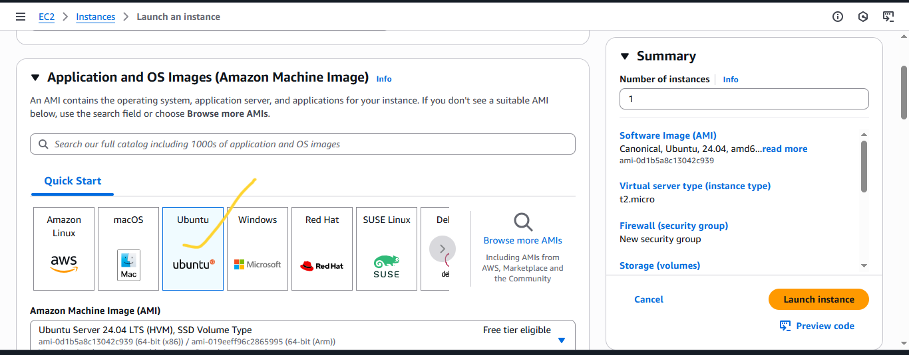

# Secure & Monitored Multipart File Upload System

## 📌 Overview

This project implements a **secure, scalable, and production-ready multipart file upload system** using **AWS S3, KMS, Flask, and JavaScript**.  
It supports:
- Large file uploads (up to 5 TB)
- SSE-KMS encryption
- Resume support on network failure
- Real-time progress tracking
- Monitoring & alerting with CloudTrail + CloudWatch

---

## 1️⃣ Project Concept & Motivation

The goal was to design a **security-first, fault-tolerant file upload system** with:
- **Encryption:** SSE-KMS (KMS key rotation enabled)
- **RBAC:** Uploader vs Viewer roles
- **Scalability:** Multipart upload for very large files
- **Observability:** Logs, metrics, alarms

---

## 2️⃣ Architecture Diagram


---
## 1. Prerequisites
Before starting, ensure you have:
1. An **AWS Account**.
2. Basic knowledge of **Linux commands**.
3. A **key pair** for SSH access.
4. AWS **security group rules** allowing:
   - HTTP (Port 80)
   - SSH (Port 22)
   - Custom Port (Port 5000) - For the Frontend
5. A local terminal (Linux/Mac/git bash) or **PuTTY** (Windows).

---
## 📂 Project Structure

The repository follows a simple, organized layout:
```
.
├── app.py # Flask backend (handles initiate, presign, complete)
├── requirements.txt # Python dependencies
├── .env # Environment variables (not committed)
├── .gitignore # Ignore venv, logs, and secrets
├── static/ # Frontend files (JS, CSS)
│ └── upload.js # Client-side multipart upload logic
├── templates/ # HTML templates (served by Flask)
│ └── index.html # Simple upload page
├── logs/ # (Optional) Local logs directory
└── README.md # Project documentation
```

- **`app.py`** → Main Flask application
- **`static/upload.js`** → Handles chunking, presigned URLs, progress tracking
- **`templates/index.html`** → Simple UI to test uploads
- **`.env`** → Holds `AWS_REGION`, `BUCKET_NAME`, `KMS_KEY_ID` (excluded from git)
- **`logs/`** → For application logs if needed
---

## 2. Step-by-Step Implementation

### Step 1: Launch an EC2 Instance
- Log into the AWS Management Console to setup the EC2 Instance.
---

---
- Search for **EC2  on the search bar**.
---

---
- Click on Launch Instance.
---

---
- Enter the name of your web server
---

---
- Choose **Ubuntu Server 22.04 LTS** (or latest version).
---

---
- Select an **instance type** (e.g., t2.micro for free tier).
---

---
- Configure **Security Group** to allow HTTP, HTTPS, SSH.
---

---
- Launch and download the `.pem` key pair or use an already created key pair.
---

---

---
- Configure the storage to what you prefer but we will leave everything default.
---

---
- Scroll down and at your right, click on Launch Instance.
---

---
- You should see this if everything is successful
---

---
- Make sure the status checks are all checked ensuring that our instance has been launched and running
---

---
- Now, copy the public IP Address of your instance
---

---
- Another way to retrieve your IP Address is to use this command
```bash
 TOKEN=`curl -X PUT "http://169.254.169.254/latest/api/token" -H "X-aws-ec2-metadata-token-ttl-seconds: 21600"` && curl -H "X-aws-ec2-metadata-token: $TOKEN" -s http://169.254.169.254/latest/meta-data/public-ipv4
```
- OR by this
```bash
 curl -s http://169.254.169.254/latest/meta-data/public-ipv4
```
---
### Step 2: Connect to Your Instance
From your terminal, cd Downloads/:
```bash
chmod 400 lamp-stack-kp.pem
ssh -i lamp-stack-kp.pem ubuntu@<EC2_PUBLIC_IP>
```
- Type `yes` 
---

---
- You're in when you see this
---

---

### Step 3: Update and Upgrade the System
```bash
sudo apt update && sudo apt upgrade -y
```
---
- Create a file called `requirements.txt`
- Copy and paste these into it
```
Flask==3.0.3
boto3==1.34.0
python-dotenv==1.0.1
Werkzeug==3.0.3
itsdangerous==2.2.0
click==8.1.7
Jinja2==3.1.4
```
---
## 3️⃣ Role-Based Access Control (RBAC)

| Role      | Allowed Actions |
|----------|----------------|
| **Uploader** | `s3:PutObject`, `s3:AbortMultipartUpload`, `s3:ListMultipartUploadParts`, `kms:GenerateDataKey*` |
| **Viewer**   | `s3:GetObject`, `kms:Decrypt` |

Uploader IAM Policy Example:
```json
{
  "Version": "2012-10-17",
  "Statement": [
    {
      "Effect": "Allow",
      "Action": ["s3:PutObject", "s3:AbortMultipartUpload", "s3:ListMultipartUploadParts"],
      "Resource": "arn:aws:s3:::my-secure-uploads-klawbucket/*"
    },
    {
      "Effect": "Allow",
      "Action": ["kms:GenerateDataKey*", "kms:Encrypt", "kms:Decrypt"],
      "Resource": "arn:aws:kms:us-east-2:<ACCOUNT_ID>:key/<KMS_KEY_ID>"
    }
  ]
}
```

Viewer IAM Policy Example:
```json
{
  "Version": "2012-10-17",
  "Statement": [
    {
      "Effect": "Allow",
      "Action": ["s3:GetObject"],
      "Resource": "arn:aws:s3:::my-secure-uploads-klawbucket/*"
    },
    {
      "Effect": "Allow",
      "Action": ["kms:Decrypt"],
      "Resource": "arn:aws:kms:us-east-2:<ACCOUNT_ID>:key/<KMS_KEY_ID>"
    }
  ]
}

```
## 4️⃣ Flask Backend Code
`app.py`:
```python
import os
import boto3
from flask import Flask, request, jsonify
from dotenv import load_dotenv

load_dotenv()
app = Flask(__name__)

AWS_REGION = os.getenv("AWS_REGION")
BUCKET = os.getenv("BUCKET_NAME")
KMS_KEY_ID = os.getenv("KMS_KEY_ID")

s3 = boto3.client("s3", region_name=AWS_REGION)

@app.route("/initiate", methods=["POST"])
def initiate():
    data = request.json
    key = data.get("key")
    response = s3.create_multipart_upload(
        Bucket=BUCKET,
        Key=key,
        ServerSideEncryption="aws:kms",
        SSEKMSKeyId=KMS_KEY_ID
    )
    return jsonify({"uploadId": response["UploadId"]})

@app.route("/presign", methods=["POST"])
def presign():
    data = request.json
    key, upload_id, part_number = data["key"], data["uploadId"], data["partNumber"]
    url = s3.generate_presigned_url(
        "upload_part",
        Params={
            "Bucket": BUCKET,
            "Key": key,
            "UploadId": upload_id,
            "PartNumber": part_number
        },
        ExpiresIn=3600
    )
    return jsonify({"url": url})

@app.route("/list-parts")
def list_parts():
    upload_id = request.args.get("uploadId")
    key = request.args.get("key")
    response = s3.list_parts(Bucket=BUCKET, Key=key, UploadId=upload_id)
    parts = [{"PartNumber": p["PartNumber"], "ETag": p["ETag"], "Size": p["Size"]} for p in response.get("Parts", [])]
    return jsonify(parts)

@app.route("/complete", methods=["POST"])
def complete():
    data = request.json
    response = s3.complete_multipart_upload(
        Bucket=BUCKET,
        Key=data["key"],
        UploadId=data["uploadId"],
        MultipartUpload={"Parts": data["parts"]}
    )
    return jsonify(response)

```
## 5️⃣ Frontend Code
`static/upload.js`
```python
export async function uploadFile(file, key, onProgress) {
  const init = await fetch("/initiate", {
    method: "POST",
    headers: { "Content-Type": "application/json" },
    body: JSON.stringify({ key }),
  });
  const { uploadId } = await init.json();

  const MAX_PARTS = 10000;
  const MIN_PART_SIZE = 5 * 1024 * 1024;
  const IDEAL_TARGET_PARTS = 1000;
  let partSize = 30 * 1024 * 1024;
  const requiredPartSize = Math.ceil(file.size / IDEAL_TARGET_PARTS);
  if (requiredPartSize > partSize) partSize = requiredPartSize;
  if (partSize < MIN_PART_SIZE) partSize = MIN_PART_SIZE;

  const totalParts = Math.ceil(file.size / partSize);
  if (totalParts > MAX_PARTS) partSize = Math.ceil(file.size / MAX_PARTS);

  const parts = [];
  let uploadedBytes = 0;
  let partNumber = 1;

  for (let start = 0; start < file.size; start += partSize) {
    const chunk = file.slice(start, start + partSize);
    const presignResp = await fetch("/presign", {
      method: "POST",
      headers: { "Content-Type": "application/json" },
      body: JSON.stringify({ key, uploadId, partNumber }),
    });
    const { url } = await presignResp.json();

    await new Promise((resolve, reject) => {
      const xhr = new XMLHttpRequest();
      xhr.open("PUT", url, true);

      xhr.upload.onprogress = (e) => {
        if (e.lengthComputable) {
          const percent = (((uploadedBytes + e.loaded) / file.size) * 100).toFixed(2);
          if (onProgress) onProgress(percent);
        }
      };

      xhr.onload = () => {
        if (xhr.status >= 200 && xhr.status < 300) {
          const etag = xhr.getResponseHeader("ETag");
          parts.push({ ETag: etag.replace(/"/g, ""), PartNumber: partNumber });
          uploadedBytes += chunk.size;
          resolve();
        } else reject(new Error(`Failed part ${partNumber}`));
      };

      xhr.onerror = () => reject(new Error("Network error"));
      xhr.send(chunk);
    });
    partNumber++;
  }

  await fetch("/complete", {
    method: "POST",
    headers: { "Content-Type": "application/json" },
    body: JSON.stringify({ key, uploadId, parts }),
  });
  if (onProgress) onProgress(100);
}

```
## 6️⃣ Monitoring & Security

- CloudTrail: Enabled to log all S3 + KMS API calls.
```bash
aws cloudwatch put-metric-alarm \
  --alarm-name S3Upload4xxErrors \
  --metric-name 4xxErrors \
  --namespace AWS/S3 \
  --statistic Sum \
  --period 300 \
  --threshold 1 \
  --comparison-operator GreaterThanOrEqualToThreshold \
  --dimensions Name=BucketName,Value=my-secure-uploads-klawbucket Name=StorageType,Value=AllStorageTypes \
  --evaluation-periods 1 \
  --alarm-actions arn:aws:sns:us-east-2:067717894834:S3UploadAlerts

```
- CloudWatch Alarms:
```bash
aws cloudwatch put-metric-alarm \
  --alarm-name S3Upload5xxErrors \
  --metric-name 5xxErrors \
  --namespace AWS/S3 \
  --statistic Sum \
  --period 300 \
  --threshold 1 \
  --comparison-operator GreaterThanOrEqualToThreshold \
  --dimensions Name=BucketName,Value=my-secure-uploads-klawbucket Name=StorageType,Value=AllStorageTypes \
  --evaluation-periods 1 \
  --alarm-actions arn:aws:sns:us-east-2:067717894834:S3UploadAlerts


```


